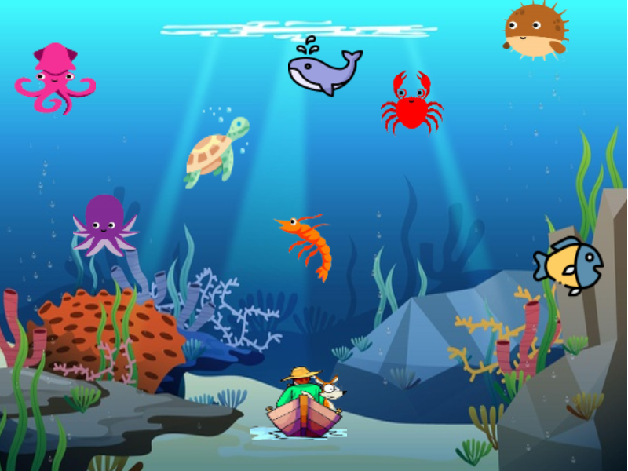

<p align="center">
    
  </a>

  <p align="center">
    "The Beah Hunt"
    <br /><br />
    <a href="https://youtu.be/2acCnshbTMc">Video Demo</a>
  </p>
</p>
<center>

<!-- TABLE OF CONTENTS -->

## Table of Contents

- [About the Project](#about-the-project)
- [Built With](#built-with)

<!-- ABOUT THE PROJECT -->

## About The Project

A game where you need to catch the various sea creatures in the net and earn points<br>
Just run the <strong>main.py</strong> file and ENJOY!!

### Built With
The project is built using basic Python code.</br>
The  various python modules used in project:
- Pygame
- Random
- Math

### Note
If you get an error of module not found while running the project. Just type
```sh
pip install pygame
```
in the terminal and press <strong>Enter</strong>
